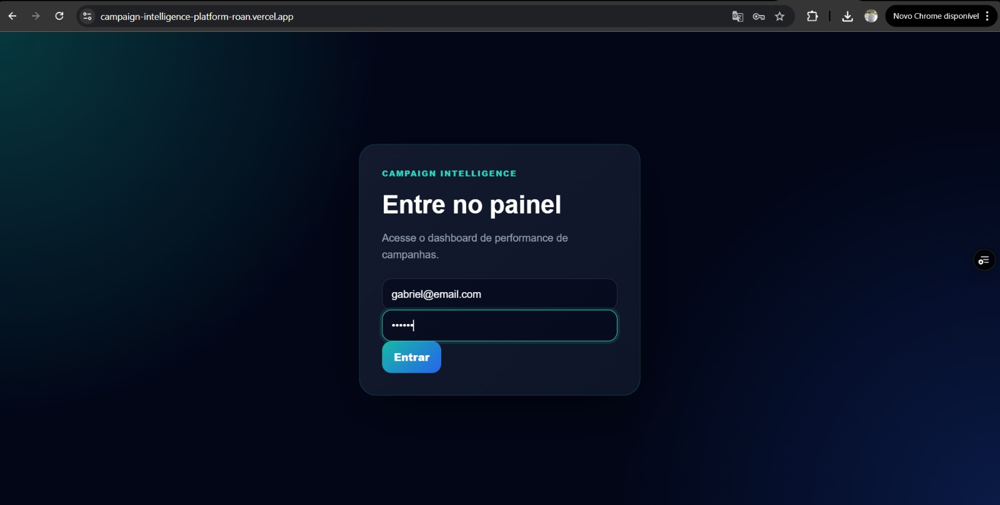
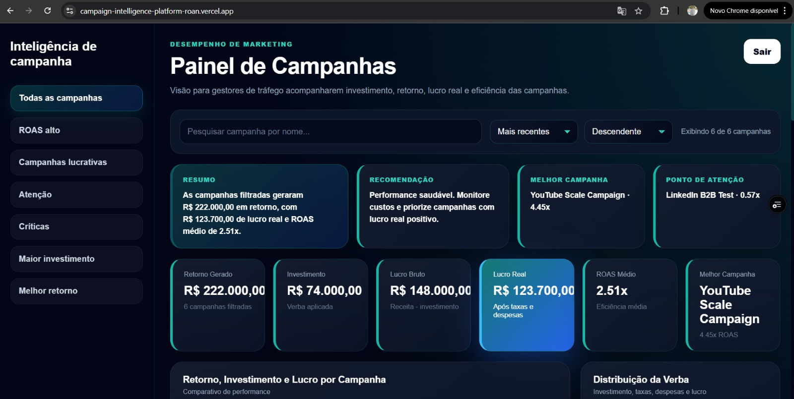
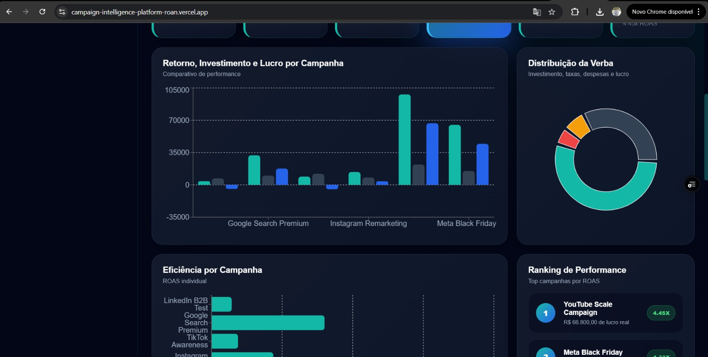
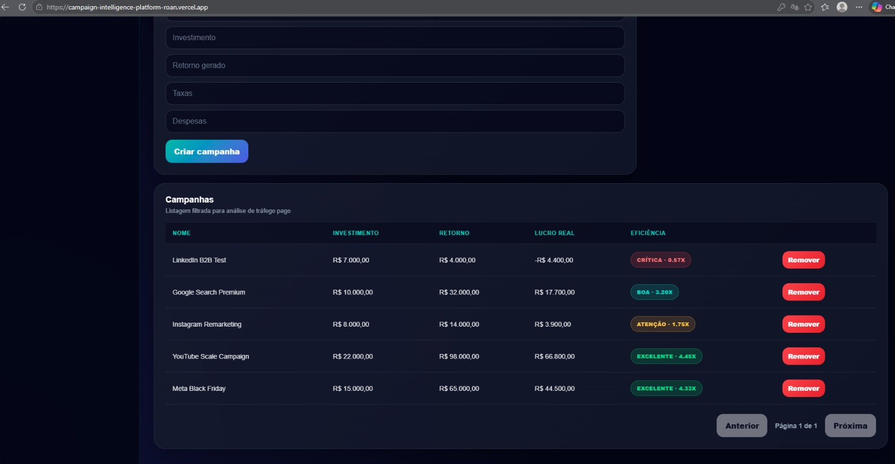

# Campaign Intelligence Platform

Aplicação fullstack para gerenciamento inteligente de campanhas de marketing, desenvolvida com foco em backend, autenticação segura, regras de negócio no servidor e visualização estratégica de métricas em um dashboard interativo.

---

# Preview

## Login



---

## Dashboard



---

## Analytics



---

## Gestão de Campanhas



---

## Links do Projeto

### Frontend

https://campaign-intelligence-platform-roan.vercel.app/

### Backend API

https://campaign-intelligence-platform.onrender.com/

### Health Check

https://campaign-intelligence-platform.onrender.com/health

### Repositório

https://github.com/gabrieltrisi/campaign-intelligence-platform

---

## Usuário de Teste

```txt
Email: gabriel@email.com
Senha: 123456
```

Também é possível criar uma nova conta diretamente pela aplicação.

---

## Objetivo do Projeto

Este projeto foi desenvolvido como desafio técnico backend, com objetivo de demonstrar conhecimentos em:

- Desenvolvimento de APIs RESTful
- Arquitetura backend com TypeScript
- Autenticação JWT
- Persistência de dados
- Organização de código
- Regras de negócio
- Integração frontend/backend
- Visualização de métricas estratégicas

---

## Preview

### Dashboard

- KPIs financeiros
- Gráficos de performance
- Ranking de campanhas
- Filtros inteligentes
- Busca por nome
- Ordenação dinâmica
- Insights automáticos
- Interface responsiva

### Login

- Autenticação JWT
- Rotas protegidas
- Persistência de sessão
- Feedback visual com toast notifications

---

## Tecnologias Utilizadas

### Backend

- Node.js
- TypeScript
- Express
- Prisma ORM
- SQLite
- JWT
- bcrypt
- Zod
- Express Rate Limit

### Frontend

- React
- TypeScript
- Vite
- Recharts
- React Hot Toast
- CSS3

---

## Funcionalidades

### Autenticação

- Cadastro de usuários
- Login com JWT
- Rotas protegidas
- Middleware de autenticação
- Criptografia de senha com bcrypt

### Campanhas

- Cadastro de campanhas
- Listagem paginada
- Busca por nome
- Ordenação dinâmica
- Exclusão de campanhas
- Filtros estratégicos

### Dashboard Inteligente

- KPIs financeiros
- ROAS médio
- Lucro bruto
- Lucro real
- Melhor campanha
- Ranking de performance
- Gráficos de distribuição
- Insights automáticos

### Segurança e Qualidade

- Validação com Zod
- Rate limiting
- Middleware global de erros
- Proteção de rotas
- Logger de requisições
- Health check
- Estrutura escalável

---

## Regras de Negócio

Todas as métricas financeiras são calculadas no backend.

| Métrica     | Fórmula                            |
| ----------- | ---------------------------------- |
| Lucro Bruto | Receita - Custo                    |
| Lucro Real  | Receita - Custo - Taxas - Despesas |
| ROAS        | Receita / Custo                    |

---

## Endpoints

### Auth

#### Registrar usuário

```http
POST /auth/register
```

#### Login

```http
POST /auth/login
```

---

### Campaigns

#### Criar campanha

```http
POST /campaigns
```

Rota protegida por JWT.

#### Listar campanhas

```http
GET /campaigns
```

Rota protegida por JWT.

#### Query Params

| Query  | Descrição                  |
| ------ | -------------------------- |
| page   | Página atual               |
| limit  | Quantidade por página      |
| search | Busca por nome da campanha |
| sortBy | Campo de ordenação         |
| order  | asc ou desc                |

Exemplo:

```http
GET /campaigns?page=1&limit=10&search=meta&sortBy=roas&order=desc
```

#### Remover campanha

```http
DELETE /campaigns/:id
```

Rota protegida por JWT.

---

## Arquitetura do Projeto

```bash
campaign-intelligence-platform
├── backend
│   ├── prisma
│   │   ├── migrations
│   │   ├── schema.prisma
│   │   └── seed.ts
│   │
│   ├── src
│   │   ├── middlewares
│   │   ├── routes
│   │   ├── schemas
│   │   ├── services
│   │   ├── utils
│   │   └── server.ts
│   │
│   ├── package.json
│   └── tsconfig.json
│
├── frontend
│   ├── src
│   │   ├── App.tsx
│   │   ├── App.css
│   │   ├── main.tsx
│   │   └── assets
│   │
│   ├── package.json
│   └── vite.config.ts
│
├── assets
│   ├── login.png
│   ├── dashboard.png
│   ├── charts.png
│   └── campaigns-list.png
│
└── README.md
```

---

## Como Executar Localmente

### 1. Clonar o repositório

```bash
git clone https://github.com/gabrieltrisi/campaign-intelligence-platform.git
cd campaign-intelligence-platform
```

---

### 2. Backend

```bash
cd backend
npm install
```

Crie um arquivo `.env` dentro da pasta `backend`:

```env
PORT=3333
JWT_SECRET=your_secret
DATABASE_URL="file:./dev.db"
FRONTEND_URL=http://localhost:5173
```

Executar migrations:

```bash
npx prisma migrate dev
```

Popular banco com dados iniciais:

```bash
npm run seed
```

Rodar backend:

```bash
npm run dev
```

Backend local:

```txt
http://localhost:3333
```

---

### 3. Frontend

```bash
cd frontend
npm install
```

Crie um arquivo `.env` dentro da pasta `frontend`:

```env
VITE_API_URL=http://localhost:3333
```

Rodar frontend:

```bash
npm run dev
```

Frontend local:

```txt
http://localhost:5173
```

---

## Health Check

```http
GET /health
```

Resposta esperada:

```json
{
  "status": "healthy",
  "database": "connected",
  "version": "1.0.0"
}
```

---

## Decisões Técnicas

- O backend foi desenvolvido com TypeScript para maior segurança e previsibilidade.
- O Prisma foi escolhido para facilitar a modelagem e persistência dos dados.
- O SQLite foi utilizado por simplicidade e facilidade de execução local.
- A autenticação foi implementada com JWT.
- As senhas são criptografadas com bcrypt.
- As validações de entrada são feitas com Zod.
- As métricas de negócio são calculadas no backend para garantir consistência.
- O frontend consome a API de forma autenticada e exibe os dados em formato visual.
- O dashboard foi criado para demonstrar o consumo da API de forma clara e estratégica.

---

## Diferenciais Implementados

Mesmo sendo um desafio com foco principal em backend, foram adicionadas melhorias extras:

- Dashboard estilo SaaS
- UX moderna
- Interface responsiva
- Sistema de insights
- Paginação no backend
- Busca dinâmica
- Ordenação por métricas
- Toast notifications
- Health check endpoint
- Logger de requisições
- Rate limiting
- Deploy do backend
- Deploy do frontend
- Estrutura de código organizada

---

## Observação sobre Deploy

O backend está hospedado no plano gratuito do Render.  
Por isso, caso o serviço fique inativo por algum tempo, a primeira requisição pode demorar alguns segundos para responder enquanto o servidor é reativado.

---

## Melhorias Futuras

- Testes automatizados
- Refresh token
- Exportação de relatórios
- Dashboard analítico avançado
- Tema dinâmico
- Docker
- CI/CD
- Banco PostgreSQL em produção

---

# Live Demo

Frontend:
https://campaign-intelligence-platform-roan.vercel.app/

API:
https://campaign-intelligence-platform.onrender.com/health

---

## Autor

Desenvolvido por Gabriel Trisi.

GitHub: https://github.com/gabrieltrisi
